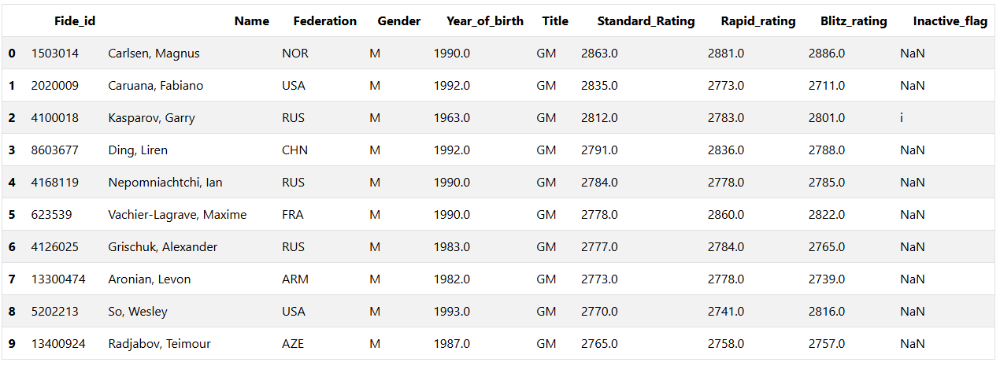
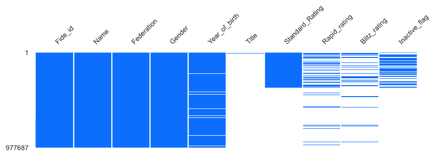
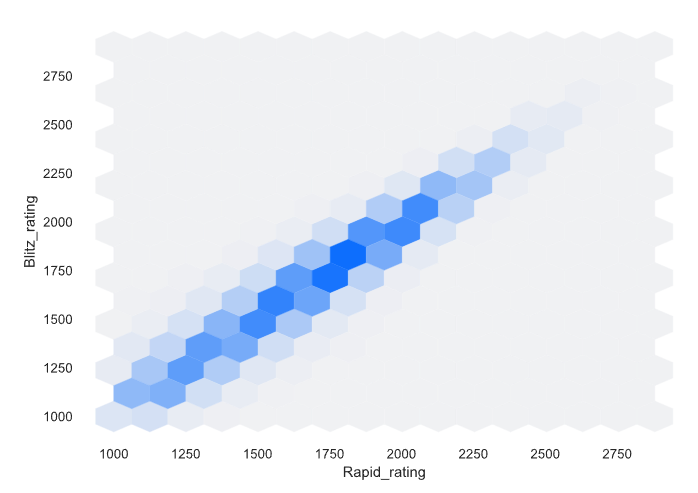

# HSE-zero-module

Это репозиторий с заданиями в рамках нулевого модуля магистратуры "Искусственный интеллект"

## Homework 1

В ходе работы проведен разведочный анализ набора данных, содержащего информацию о шахматистах в международной системе FIDE.
Набор имеет 997687 строк и 10 столбцов.

Признаки перечислены ниже.
1. Fide_id - идентификационный номер.
2. Name - имя.
3. Federation - представляемая шахматная федерация.
4. Gender - пол.
5. Year_of_birth - год рождения.
6. Title - шахматный титул.
7. Standard_Rating - рейтинг в классическом режиме.
8. Rapid_rating - рейтинг в быстром режиме.
9. Blitz_rating - рейтинг в блиц режиме.
10. Inactive_flag - флаг неактивности.

В ходе анализа построен EDA отчет средствами ProfileReport из библиотеки data_profiling. Рассмотрена структура данных, объяснены некоторые особенности, исследована связанность признаков.

Данные можно использовать для исследования закономерностей в рейтингах игрока и в будущем попытаться предсказать значения Эло в разных режимах, по имеющемуся рейтингу в другом режиме, году рождения, титулу.

Подробно с результатми можно ознакомиться в файле "Результаты анализа World Top Chess Players (August-2020).docx"
